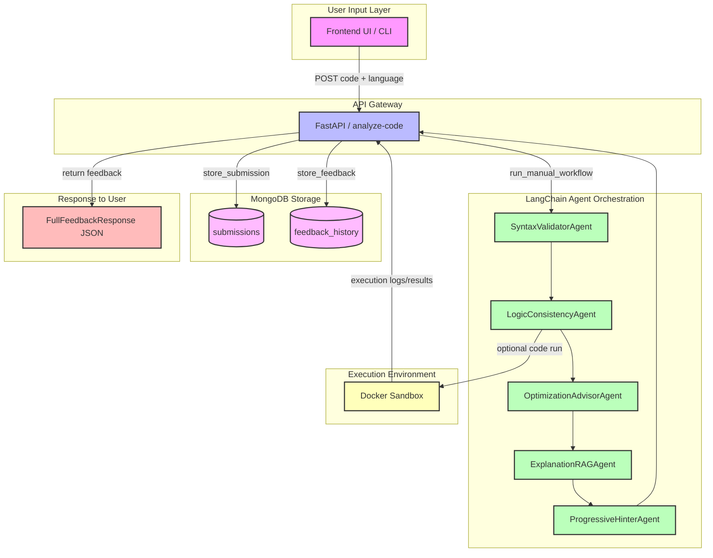

# AI Code Evaluator Architecture (with LangChain & MongoDB)

This architecture outlines a full-stack AI-powered code evaluator system. The diagram below illustrates components, their interactions, and data persistence in MongoDB.

---

## **Mermaid Architecture Diagram**

---

### **Component Descriptions**

1. **User Input Layer** (`Frontend UI / CLI`)

   * Collects code, language, and preferences

2. **API Gateway** (`FastAPI`)

   * Endpoint `/analyze-code`
   * Validates input, orchestrates workflow
   * Background tasks for MongoDB storage

3. **LangChain Agents**

   * **SyntaxValidatorAgent**: Checks syntax via `ChatPromptTemplate` → Gemini LLM → `JsonOutputParser`
   * **LogicConsistencyAgent**: Identifies logical flaws with LLM prompts
   * **OptimizationAdvisorAgent**: Suggests code improvements (Big-O rationale)
   * **ExplanationRAGAgent**: Uses FAISS retriever + embeddings to ground explanations
   * **ProgressiveHinterAgent**: Generates staged hints & final fix using LLM

4. **Execution Environment** (`Docker Sandbox`)

   * (Optional) Runs code against test cases, captures stdout/stderr, exit codes

5. **Database Layer** (`MongoDB`)

   * **submissions**: Stores session\_id, learner\_id, code, language, timestamp
   * **feedback\_history**: Stores full feedback payload (syntax, logic, optimizations, explanations, hints, final\_fix)

6. **Output Layer** (`JSON Response`)

   * Returns `FullFeedbackResponse` containing all feedback sections

---

Embed this Mermaid diagram and descriptions in your GitHub README for a clear, colorful architecture overview.
